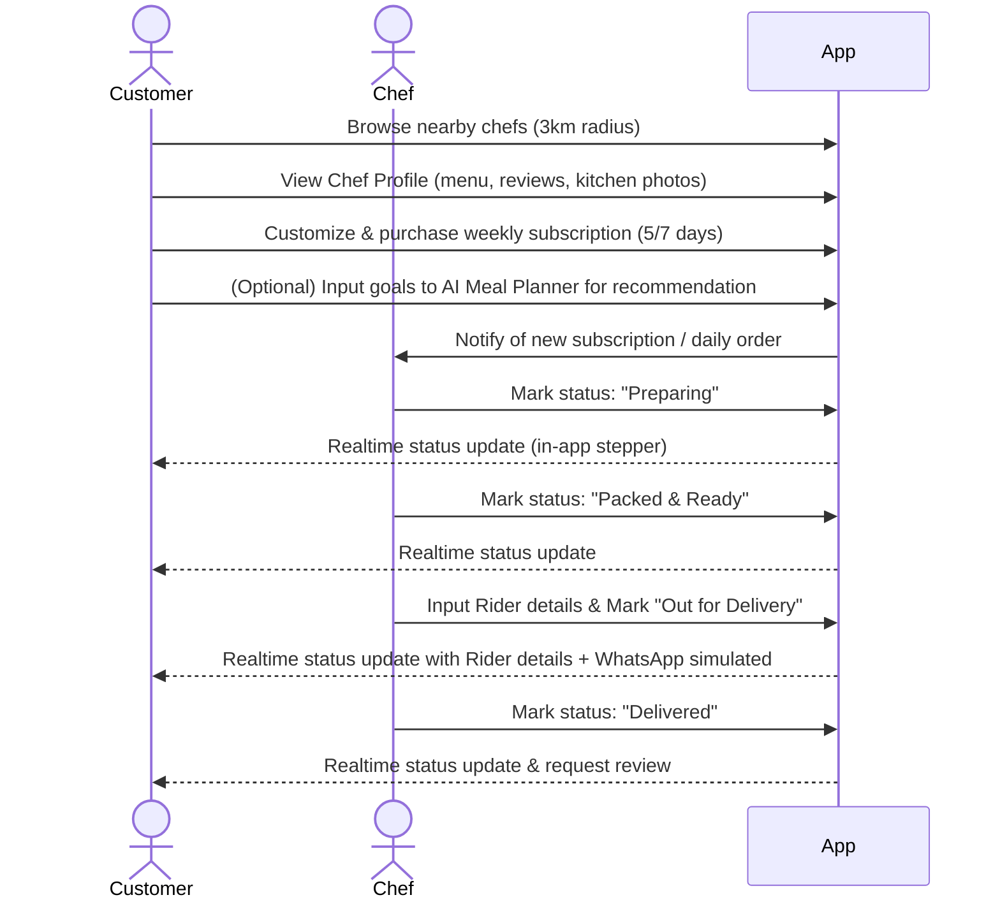

# Project Overview: DastarKhwan

DastarKhwan is a home chef marketplace web application designed for the Karachi market. It connects home cooks (often women operating from their household kitchens) with nearby families, students, and working professionals who seek affordable, clean, and authentic daily or weekly home-cooked meals. Built as a responsive web app, it features "hyper-local" chef discovery, weekly meal subscription management, an AI-powered personalized meal planner, and a context-appropriate manual delivery coordination system that updates statuses via Supabase Realtime and simulates WhatsApp notifications for seamless chef-to-customer coordination.

## Goals

1. **Empower Home Chefs**: Enable local home cooks to set up digital storefronts, manage their menus, and earn income with zero technical overhead.
2. **Ensure Trust & Hygiene**: Address the Karachi food hygiene deficit by providing transparent chef profiles containing verified kitchen photos, neighbor reviews, and video reels.
3. **Minimize Decision Fatigue**: Provide a streamlined weekly subscription flow so families can schedule their meals once and receive them reliably.
4. **Context-Appropriate Tracking**: Replace complex, high-maintenance GPS map tracking and rider networks with a manual coordination UI where the chef manually inputs external rider details.

## Core User Flow

## Features

### 1. Discovery & Profiles
- **Hyper-Local Feed**: Filter and sort home cooks within a 3km radius.
- **Chef Profiles**: Bios, verified kitchen photo galleries, reviews, distance, and community Trust Scores.
- **Cuisine and Availability Tags**: Filter chefs by dietary tags (e.g., low-carb, diabetic-friendly, daily specials) and operating days.

### 2. Subscription & Ordering
- **Weekly Subscription Wizard**: Configure 5-day or 7-day meal plans, select delivery windows, and choose payment methods (mocked Easypaisa/JazzCash/Cash on Delivery).
- **Subscription Manager**: Pause, skip, or modify specific meals in the upcoming week before the daily cutoff time.
- **Catering Requests**: Structure form to book chefs for small events/dawats with guest counts and menu preferences.

### 3. Chef Dashboard
- **Storefront Configurator**: Onboarding wizard to build menu cards, upload kitchen photos, and specify delivery zones.
- **Order Roster**: Clean lists for today's deliveries, subscription plans, and incoming catering requests.
- **Earnings & Analytics**: Visual charts showing weekly revenue, commission deductions (15-20%), and payout history.

### 4. AI & Smart Features
- **AI Meal Planner**: Conversational chat interface powered by OpenRouter (supporting models like Claude). Takes customer dietary preferences, health goals, and budget, matching them to nearby home cooks' menus with explanations.

### 5. Manual Delivery Coordination & Tracking
- **Chef Rider Assignment UI**: Manual status buttons per active order: *Preparing* → *Packed & Ready* → *Out for Delivery* (Chef enters Rider Name and Phone Number) → *Delivered*.
- **Realtime Stepper UI**: Customer-side stepper component updating instantly via Supabase Realtime. Displays assigned rider's name and phone number once dispatched so customers can contact them directly.
- **WhatsApp Notification Hooks**: Hook triggers that mock or dispatch WhatsApp texts via Twilio during status transitions (e.g. sending rider contact details when the order is out for delivery).

## In-Scope vs. Out-of-Scope

### In-Scope (Build for Real)
- Seed database with 6 mock Karachi chefs (locations in DHA, Clifton, Gulshan-e-Iqbal) with complete menus and reviews.
- Complete React + Vite mobile-responsive frontend.
- Supabase auth (using phone/email OTP pattern preferred in Pakistan).
- Active order stepper synced via Supabase Realtime subscriptions.
- AI meal planning chat with live streaming recommendations from OpenRouter.
- Chef storefront manager, onboarding checklist, and revenue charts.

### Out-of-Scope (Fake or Defer)
- **Rider Network & Dedicated Rider App**: The platform has no rider onboarding, rider portals, or driver matching. Delivery is managed externally by the chef, who manually enters rider info.
- **Real-Time GPS Map Tracking**: Real-time rider tracking is completely omitted. Leaflet.js maps only display static chef/kitchen locations.
- **Automatic Payment Settlement**: Payment gateways will be visual mocks (Easypaisa/JazzCash sandbox/UI-only).
- **Group Order Pooling Backend**: Neighbors order pooling will be shown as front-end UI banners, while batch pooling logic remains mocked.
- **Chef KYC Verification**: Automated background checks are mocked; a checklist is shown representing production guidelines.

## Success Criteria

1. A customer can log in, search for a chef in their area, select a meal package, and place a mock subscription order.
2. A chef can log into their dashboard, view the new order, click through the status chain, and manually assign external rider details (name and phone) when marking the order as "Out for Delivery".
3. The customer's order tracking screen updates instantly (without page refresh) to reflect status updates and displays the rider's name and phone number.
4. The user can interact with the OpenRouter AI chat helper and get relevant local chef recommendations.
