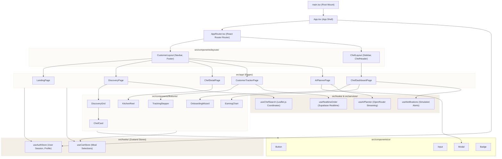

# Component Architecture: DastarKhwan

The diagram below details the structural layout of the Vite + React SPA, demonstrating how layout wrappers, routing modules, feature widgets, global stores, and custom services fit together.

