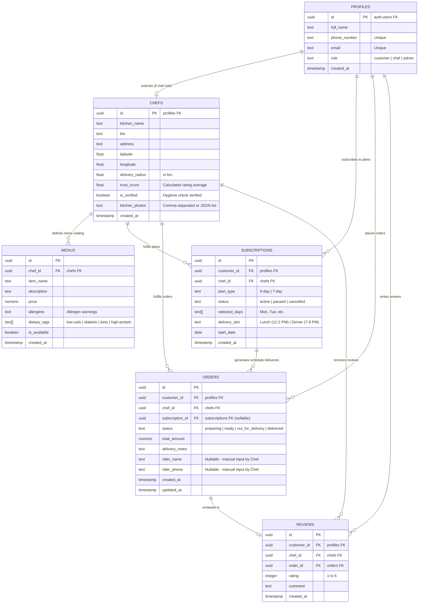

# Database Schema: DastarKhwan

This Entity-Relationship Diagram (ERD) models the PostgreSQL database structure configured in Supabase. Row-Level Security (RLS) is applied across these tables based on the relationship paths relative to the authenticated user's ID.

