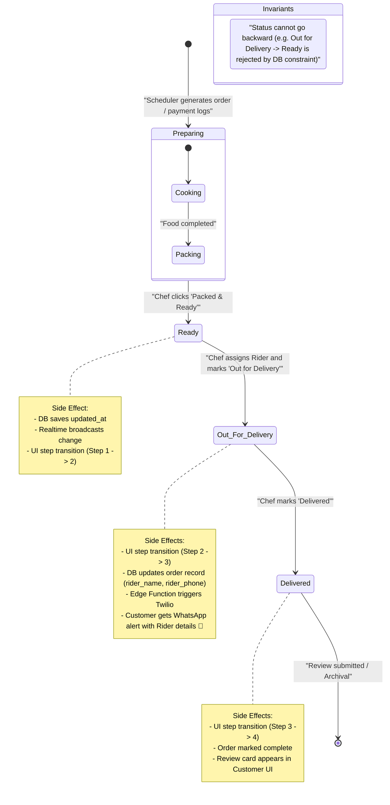

# Order Lifecycle: DastarKhwan

The diagram below tracks the lifecycle states of a daily order. It models the manual updates made by the chef and the automated side effects (realtime database streams and Twilio notifications) fired at each boundary.

## State Invariants & Rules

1. **Forward-Only Sequence**: The database enforces a check constraint on status updates, preventing any transitions that are not in sequential order:
   $$\text{Preparing} \rightarrow \text{Ready} \rightarrow \text{Out for Delivery} \rightarrow \text{Delivered}$$
2. **Access Control**: Only the chef linked to the order (`chef_id = auth.uid()`) can trigger status transitions. Customers and external entities do not have write access to order status records.
3. **Instant Synchronization**: Every change in status triggers an automatic row update hook, feeding the client's WebSocket channel immediately without page reloads.
