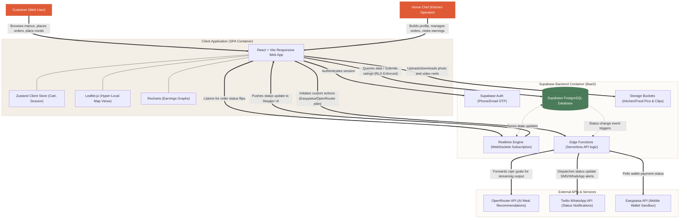

# System Architecture: DastarKhwan

The following Container Diagram (aligned with the C4 Model) illustrates the logical components of DastarKhwan, their dependencies, data storage boundaries, and integrations with external APIs.

