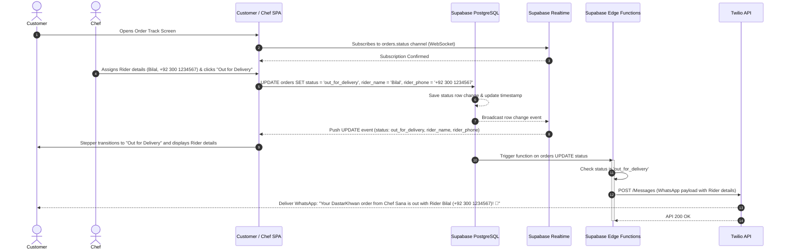
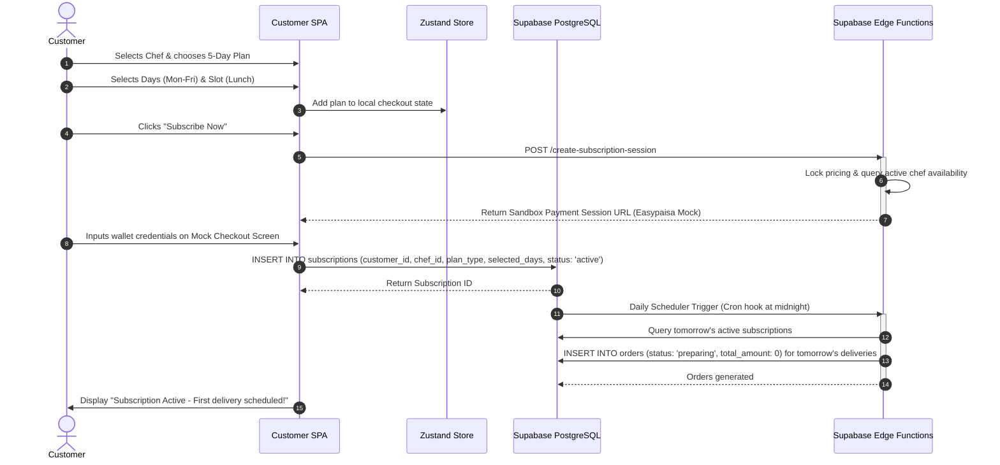
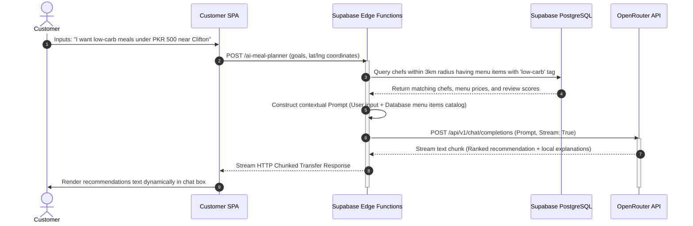

# Transactional User Flows: DastarKhwan

The sequence diagrams below detail how DastarKhwan handles the main transaction flows between the clients, backend services, and external integrations.

---

## 1. Status-Based Delivery Tracking Flow

This flow highlights how manual status flips by the chef propagate instantly to the customer's UI via Supabase Realtime and trigger WhatsApp alerts via Twilio without continuous map polling.

---

## 2. Weekly Subscription & Customization Flow

Illustrates a customer subscribing to a meal plan, configuring operating days, completing the mock payment flow, and scheduling future deliveries.

---

## 3. AI Meal Planner Recommendation Stream

This sequence maps how the user's dietary parameters match with local kitchen menus and stream responses from the OpenRouter API.

